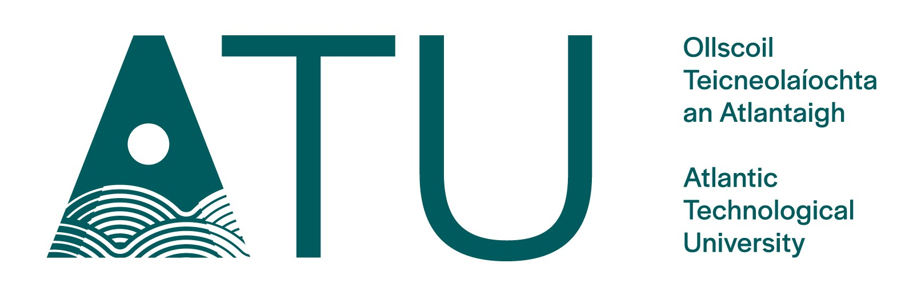

# ATU Software Engineering Project
### BSc (Hons) Computing in Software Development

## Introduction
The project will address the module learning outcomes by focusing on the following topics:
- Software as a Service / Cloud Computing 
- Web Application Architectures (MVC)
- Software Development Frameworks
- Database Management
- Requirements Specification/Automated Acceptance Testing using Behaviour-Driven Development
- Unit and Functional Testing
- Test Coverage Metrics

## Requirements
Using the Software Engineering principles mentioned above which were discussed in the lectures and lab assignments, you are required to create and deploy a web application using the Ruby on Rails framework, and write a comprenehsive suite of automated tests. You are free to come up with your own idea for what your application will do, but it can be broadly similar in style to the RottenPotatoes movie review sample application we worked on throughout the course (though obviously it must be different, i.e. not based on movies). In terms of functionality your application can be relatively simple. The focus here is not on building a complex feature-heavy application, but rather on building a simple application using solid engineering principles with thorough automated tests. Your application must conform to the specification detailed below.

### Specification 

#### Functionality
Your application should:
- support basic CRUD operations on a single resource (e.g. similar to the create, read, update and delete operations on movies supported by RottenPotatoes).
- support basic filtering and sorting functionality
- include at least one **additional feature** beyond the features we developed in labs.

#### User Story
The additional feature(s) you implement above and beyond CRUD and filtering/sorting should be documented as User Stories. The user story should be documented at the top of the Cucumber feature file for the feature.
 
#### Database
Your application should:
- use an SQL database in development and postgres in production (the relevant gems are included in the starter code). 
- define a database schema in a Rails migration, which can be used to create a database using the `rake db:migrate` task.
- define seed data which can be used to populate the database with initial data using the `rake db:seed` task.

#### Testing
Your application should include a comprehensive suite of automated tests, specifically:
##### Cucumber
- Cucumber BDD/Acceptance tests which verify the **additional feature** works as expected. Your cucumber tests should at a minimum include 2 scenarios, testing both the happy and sad paths of the feature. Comprehensive testing of the additional feature and of the filtering/sorting functionality will be necessary to score full marks for this component.

##### RSpec
- RSpec unit/functional tests for the controller and model. Your RSpec tests should test:
  - the controller and model logic added to implement the **additional feature**.
  - whatever other controller/model logic that needs to be tested to improve code coverage.
 ##### Code Coverage
- The `simplecov` gem and necessary setup is included in the provided starter code. This will generate a detailed report of how well your code is covered by tests in `coverage/index.html`, as well as reporting the overall coverage percentage on the command line when `cucumber` and `rspec` tests are run. Use this coverage report to identify under-tested code that you need to write tests for. Note that 100% coverage isn't necessary, or even desirable. 10 marks are available for code coverage, according to the following scheme:

Code Coverage Percentage| Marks |
:---: | :---: |
| >= 85 | 10 |
| >= 70 | 8 |
| >= 55 | 6 |
| >= 40 | 4 |
| >= 25 | 2 |
| < 25 | 0 |

**All tests should pass, or else should be skipped. Code coverage marks will be reduced by 50% if any tests are failing.**

#### Deployment
- Your application should be deployed to Scalingo, complete with database and seeded with seed data. The URL to access your application on Scalingo should be included in the file [submission-scalingo-url.md](./submission-scalingo-url.md)

#### Documentation
- Add a brief (1 paragraph) description of your project and a reflection on your experience building and testing it (a couple of paragraphs is fine) to the file [project-description.md](./project-description.md).
- Your Cucumber tests should act as living documentation for your application. From reading the feature file(s) it should be clear what the additional feature is and how it works.

## Starter Code
The starter code in this repository includes a template Rails application which provides the following:
- a Gemfile with most (if not all) of the framework and test dependencies you'll need
- cucumber helper code and low-level step definitions for browser interaction (in `features/step_definitions/web_steps.rb`).
- rspec helper code
- various other useful things

**You should build your application by incrementally adding to the template application included here. All of your code should be in this repository.**

### Helper Guides
- In setting up basic CRUD functionality, the "Hello Rails" lab where we built a rails app from scratch will be useful to you, specifically:
    - Part 2: Creating a database and initial migration
    - Part 3: Create CRUD routes, actions, and views
- In setting up filtering and sorting, the Rails Intro lab will be useful to you.
- In setting up cucumber and rspec tests, the final 2 labs will be useful to you.

**Note**
When running tests, it's best to run them within the environment of your current application, using `bundle exec`, e.g:
- `bundle exec cucumber`
- `bundle exec rspec`

### Rails CLI Cheat Sheet
The Rails CLI is used for managing DBs, running a local development server, and generating code for controllers and tests. Full documentation for the Rails CLI is available [here](https://guides.rubyonrails.org/command_line.html). Some commonly used commands are provided below:

| Test | Command |
| --- | --- |
| Run DB migration to set up development DB | `bundle exec rails db:migrate`|
| Run DB migration to set up test DB | `bundle exec rails db:test:prepare`|
| Add seed data to your DB (requires script in `db/seeds.rb`) | `bundle exec rails db:seed`|
| Run rails server locally on Codio box | `rails server -b 0.0.0.0` |

### Scalingo CLI Cheat Sheet
The Scalingo command-line interface is pre-installed in your Codio workspace. Here's a collection of useful Scalingo command-line interface commands you'll likely need.

| Test | Command |
| --- | --- |
| Logging in to Scalingo CLI | `scalingo login`|
| Create new Scalingo App | `scalingo create <globally-unique-app-name>` |
| Add the postgresql-db addon to your app on Scalingo | `scalingo addons-add postgresql postgresql-starter-512` |
| Deploy latest code to Scalingo | `git push scalingo master`|
| Run DB migration to set up production DB schema on Scalingo | `scalingo run bundle exec rails db:migrate`|
| Seed production DB schema on Scalingo | `scalingo run bundle exec rails db:seed`|

## Marking Scheme
The project will be marked according to the following indicative marking scheme:

Project Component | Marks
:--- | :---: |
| CRUD operations on a single resource |  10 |
| Filtering and Sorting |  10 |
| Additional feature | 15 |
| User Story | 5 |
| DB: Migration and seed data| 5 |
| Cucumber BDD Acceptance Tests | 15 |
| RSpec Unit/Functional Test | 15 |
| Code Coverage | 10 |
| Cloud Deployment (Scalingo) | 10 |
| Project Description & Reflection | 5 |
| **TOTAL** | **100** |

## Reference Documentation
The [Rails documentation](https://guides.rubyonrails.org/v7.1.6/) is likely to be useful to you in solving problems you encounter. The `rails` command lineprovides tools with may be useful to you, some of which you've already used. Specifically, the `rails generate` command can be used to generate templates for various things like controllers, models, migrations etc., which is likely to be easier and less error-prone than creating these things by hand. Use of productivity tools like this is encouraged.

## Submission
By the submission date you are required to:
- Add the Scalingo URL of your deployed application to the file [submission-scalingo-url.md](./submission-scalingo-url.md) in this repository.
- Add a brief description of your project and a reflection of your experience building and testing it (a couple of paragraphs is fine) to the file [project-description.md](./project-description.md) file in this repository.
- Ensure that all of your code is pushed to your repository on GitHub.

(Note that submitting your code to Moodle **is not necessary**. GitHub Classroom and Codio are being used to manage this assignment, and its tools allow me full access to your code).
